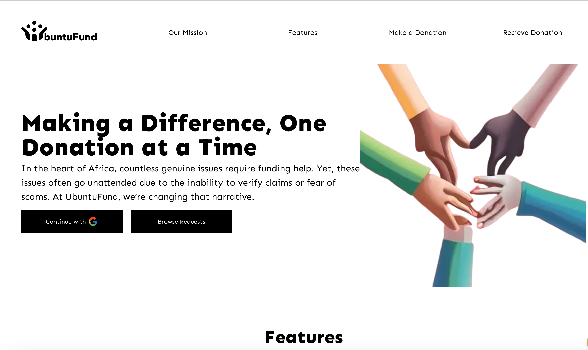

# UbuntuFund

UbuntuFund is a revolutionary platform that enhances the efficiency and effectiveness of charitable giving in Africa. By leveraging AI and Blockchain technology, it introduces a robust vetting process for funding requests and ensures the appropriate use of disbursed funds, thereby increasing trust and productivity in the philanthropic sector.



## URL

https://bent-star-free-nerve-production.pipeops.app

## Built with

- ⚡️ Next.js 13
- ⚛️ React 18
- ✨ TypeScript
- 💨 Tailwind CSS 3
- ✨ Redux toolkit
- ✨ React Query
- ✨ React-Redux
- ✨ Firebase
- 🃏 Jest — Configured for unit testing

## Features

- Landing Page: The user opens the landing page which displays information about UbuntuFund

- Donation Requests: The user can click on a Call To Action (CTA) to see available vetted and approved donation requests, similar to an e-commerce platform.

- Search and Filter: The user can search for projects via categories or country etc. Filter options should be available.

- Project Details: The user can select any project they are interested in and see details which include description, timeframe for donation, cause of the project, amount to raise, amount raised so far, proof/evidence for donation as images, videos and other info provided to inform the donor’s decision.

- Donation: The user can select to donate and see payment options including Fiat, Crypto, PayPal etc.

- Receipt and Thank You Note: After making a payment, the user gets a receipt in their email and a thank you note with info about giving them updates and providing proof of disbursement and implementation of the project.

- Registration for Donees: The user registers on the app and provides info about themselves, verifiable IDs.

- Donation Form: The user fills out a donation form and provides all information for such donation and accepts our terms which includes that we will do verification checks, collect our commission and others. Categories of donations include Education, Medical, Business, etc. Based on these categories, verification data requested might be slightly different.

- Submission and Approval: The user submits the form and is redirected to the dashboard where they will see their pending request and get a notification/email if it’s approved or rejected.
  Publication: If approved, the request is published on the website to receive funds.

- Fund Disbursement: When it’s due, users can request for the fund to be disbursed to the provided account details and donors are informed as well. Feedback from the requester is collected for testimonials.

General Features:

- Mobile Responsiveness/Better User Interface using PWA: A user-friendly and intuitive interface can significantly enhance the user experience. With UbuntuFund, users oly need to open the website once and subsequently download the app into their mobile devices

- Transparency: Provide a clear breakdown of how funds have been disbursed by providing regular updates and allows donors to track the progress of the projects they’ve funded.

- Community Engagement: To incorporate features that foster a sense of community among users, such as forums for discussion, success stories, and user ratings.

- Partnerships: Partner with local NGOs, government bodies, and influencers to increase trust and reach.

## Getting Started

To run this project locally, you will need to have Node.js, preferably version 20, pnpm, and TypeScript installed on your machine.

## Installation

Clone this repository to your local machine:

```
git clone https://github.com/todak2000/ubuntuFund.git

```

Navigate to the project directory and install the dependencies:

```
cd ubuntuFund
pnpm i
```

## Development

To start the development server, run the following command:

```
pnpm dev
```

The website will be available at http://localhost:3000.

## Deployment

This app was deployed to pipeops

## License

This project is licensed under the MIT License - see the LICENSE file for details.

## Author

Made with ♥ by [Daniel Olagunju](https://github.com/todak2000) and Team [](https://twitter.com/todak)

